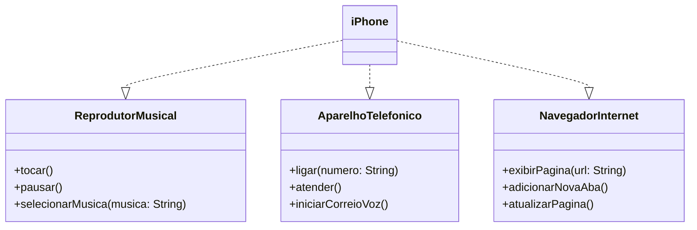

# Projeto POO - Modelagem e Diagramação de um iPhone

Este projeto foi desenvolvido como parte do desafio de POO da DIO.
O objetivo é modelar, diagramar e implementar as funcionalidades principais do iPhone.

## Funcionalidades

### Reprodutor Musical
- `tocar()`
- `pausar()`
- `selecionarMusica(String musica)`

### Aparelho Telefônico
- `ligar(String numero)`
- `atender()`
- `iniciarCorreioVoz()`

### Navegador na Internet
- `exibirPagina(String url)`
- `adicionarNovaAba()`
- `atualizarPagina()`

## Diagrama UML (Mermaid)



## Como executar

```bash
cd src
javac *.java
java Main
```

## Exemplo de Saída

```
Selecionando música: Imagine - John Lennon
Tocando música...
Música pausada.
------------------------
Ligando para: 11987654321
Atendendo chamada...
Iniciando correio de voz...
------------------------
Exibindo página: https://dio.me
Nova aba aberta.
Página atualizada.
```
